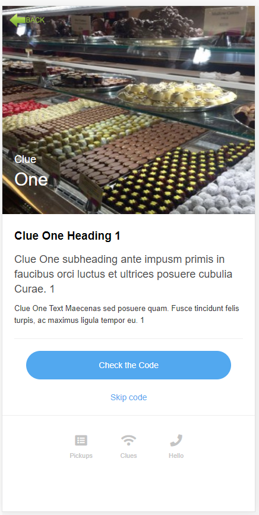

# Amazing Co PWA react.js app that is prototyped primarily built by only mobile version

  <kbd>
    
  </kbd>
  &nbsp;&nbsp;&nbsp;&nbsp;
  <kbd>
    
  </kbd>
  &nbsp;&nbsp;&nbsp;&nbsp;
  <kbd>
    
  </kbd>
    
  <kbd>
    
  </kbd>
    &nbsp;&nbsp;&nbsp;&nbsp;
  <kbd>
    
  </kbd>
    &nbsp;&nbsp;&nbsp;&nbsp;
  <kbd>
    
  </kbd>
      
  <kbd>

